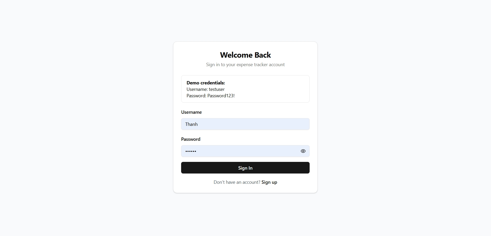
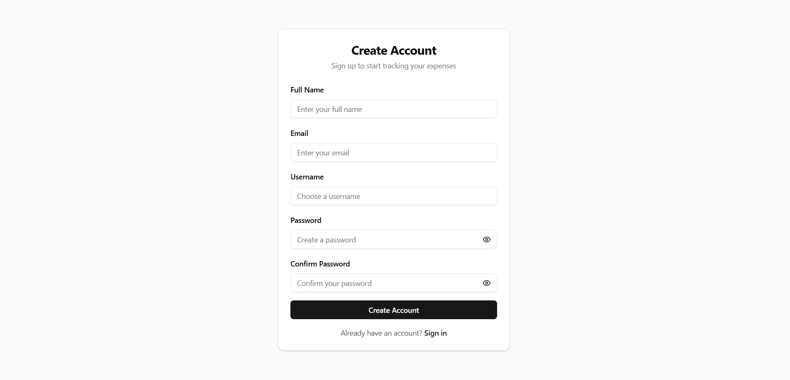
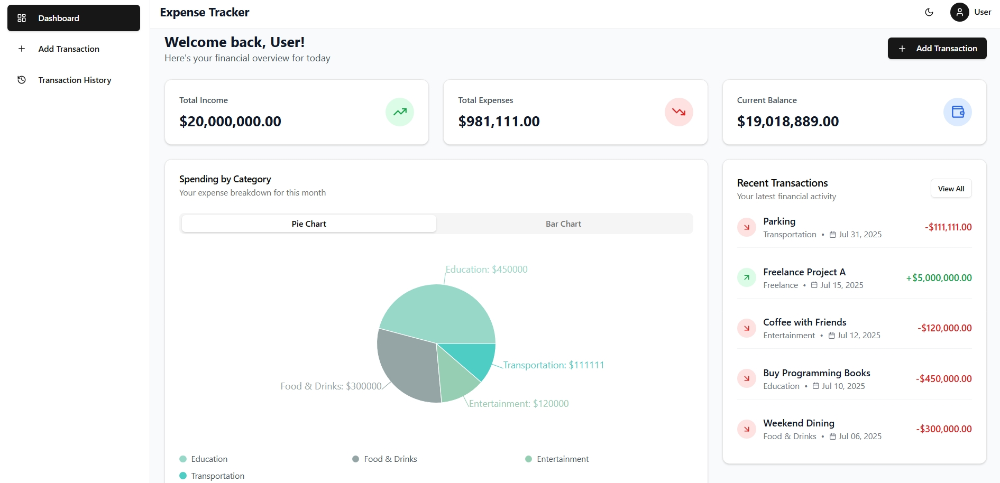
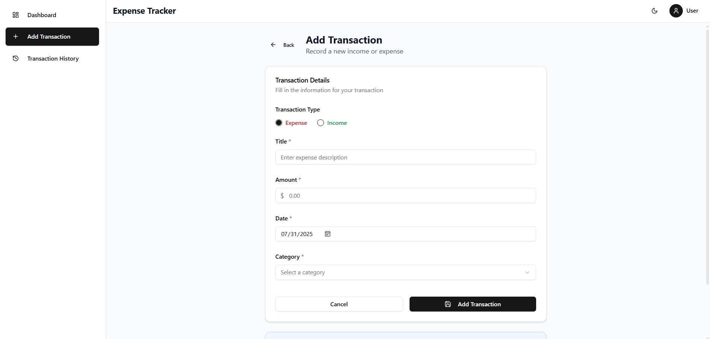
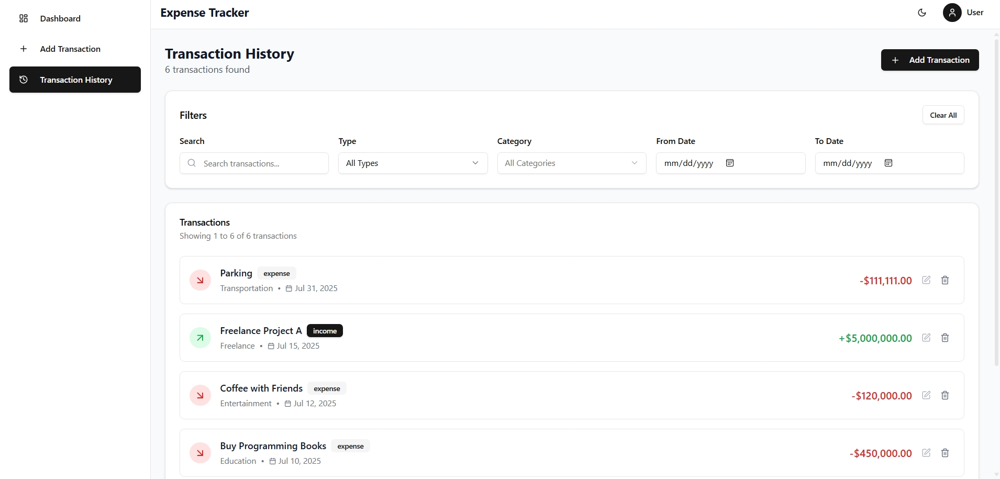

# Expense Tracker - Frontend (React)

[](https://opensource.org/licenses/MIT)  
[](https://react.dev/)  
[](https://www.typescriptlang.org/)  
[](https://vitejs.dev/)  
[](https://tailwindcss.com/)  
[](https://recharts.org/)  
[](https://jwt.io/)

This is the **frontend** for the Personal **Expense Tracker** application, built with **React** and **Vite**. The user interface is designed to offer a smooth experience, allowing users to easily manage their personal finances.

This frontend communicates with a secure **Spring Boot** backend that handles user authentication, data storage, and business logic.

## ✨ Key Features

- **User Authentication:** Secure Sign Up and Sign In functionality.
- **JWT Security:** Uses JSON Web Tokens (Access and Refresh Tokens) to protect API access.
- **Token Auto-Refresh:** Automatically refreshes Access Tokens using Axios Interceptors without disrupting user experience.
- **Protected Routes:** Important pages like Dashboard and Profile are only accessible after authentication.
- **Responsive UI:** (Optional: include this only if your app supports it) The interface is designed to work well on both desktop and mobile devices.

## 🛠️ Technologies Used

- **Framework:** [React 18+](https://reactjs.org/)
- **Build Tool:** [Vite](https://vitejs.dev/)
- **Routing:** [React Router DOM](https://reactrouter.com/)
- **State Management:** React Context API (or Redux/Zustand if used)
- **Styling:** CSS / SASS / Tailwind CSS (based on project preference)

## 🚀 Installation & Running the Project

To run this project on your local machine, follow the steps below:

### Prerequisites

- [Node.js](https://nodejs.org/) (version 18.x or above)
- `npm` or `yarn`
- A running instance of the **Expense Tracker Backend**. (You can include the link to your backend repo here.)

### Setup Steps

1. **Clone the repository:**

    ```bash
    git clone https://github.com/thanhpro0802/personal-expense-tracker-frontend.git
    cd personal-expense-tracker-frontend
    ```

2. **Install dependencies:**

    ```bash
    npm install
    # or if you're using yarn
    # yarn install
    ```

3. **Configure environment variables:**

    Create a `.env` file in the root directory of the project and add the following:

    ```env
    VITE_API_URL=http://localhost:8080
    ```

    *Note: `8080` is the default port for Spring Boot. Change it if you’re using a different one.*

4. **Start the development server:**

    ```bash
    npm run dev
    # or
    # yarn dev
    ```

5. Open your browser and go to `http://localhost:5173` (or the port Vite provides).

## 📂 Folder Structure

The project is organized in a modular structure for better maintainability and scalability:

```
src/
├── components/ # Reusable UI components
├── pages/ # Components corresponding to full pages
├── services/ # API logic (e.g., auth.service.ts, user.service.ts)
├── contexts/ # Global state management (e.g., AuthContext)
├── helpers/ # Utility functions (e.g., Axios instance with interceptors)
├── hooks/ # Custom React hooks (e.g., useAuth)
├── routes/ # Route definitions and protection
├── App.tsx
└── main.tsx
```

## 📸 Screenshots

### Signin

### Signup

### Dashboard

### Add

### History



## ✨ Author

**Nguyễn Tuấn Thành**

- 🔗 GitHub: - 🔗 GitHub: [https://github.com/thanhpro0802](https://github.com/thanhpro0802)
- 🎓 Hanoi University of Science and Technology (HUST)
- 📚 Major: Information Technology – Việt Nhật Program
- 📧 Email: tuanthanh.work@gmail.com

---

